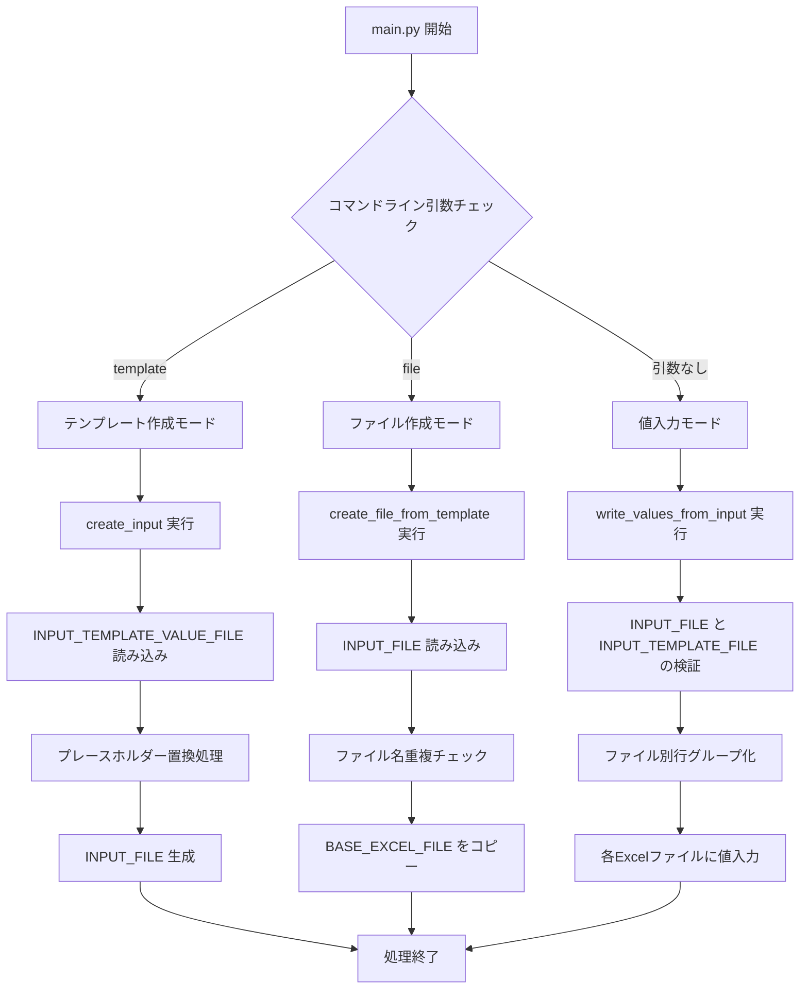
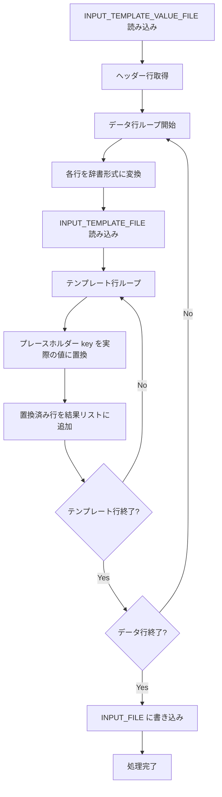
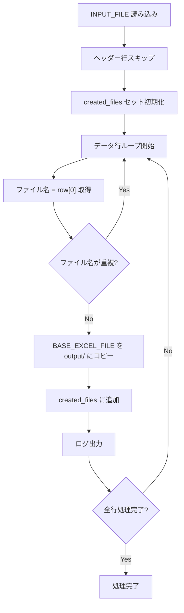
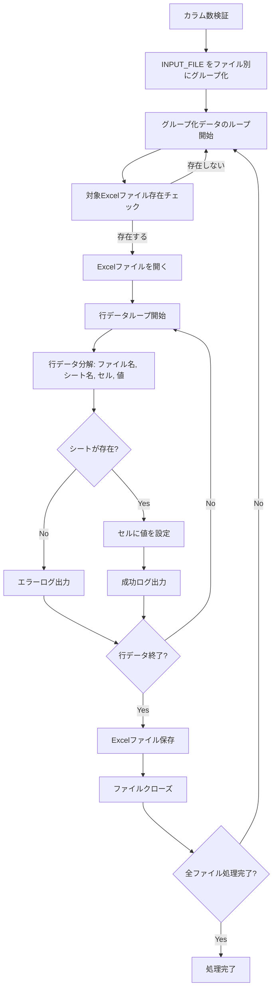

**⚠️ Claude で出力しています。**
# Excel Builder 処理フロー

## 概要

Excel Builderは、テンプレートExcelファイルをベースに、CSVデータから複数のExcelファイルを自動生成し、指定されたセルに値を入力するツールです。

## 処理モード

システムは3つの処理モードを提供します：

1. **テンプレート作成モード** (`template`)
2. **ファイル作成モード** (`file`)
3. **値入力モード** (デフォルト)

## 全体処理フロー



## 詳細処理説明

### 1. テンプレート作成モード (`python main.py template`)

このモードでは、値定義ファイルとテンプレートファイルから入力用CSVファイルを生成します。



**処理詳細：**
- `INPUT_TEMPLATE_VALUE_FILE`: 変数の値を定義するCSVファイル
- `INPUT_TEMPLATE_FILE`: プレースホルダー `${変数名}` を含むテンプレートCSV
- プレースホルダー置換により、動的にデータを生成
- 結果は `INPUT_FILE` として保存

### 2. ファイル作成モード (`python main.py file`)

このモードでは、input.csvファイルから一意のファイル名を抽出し、ベースExcelファイルのコピーを作成します。



**処理詳細：**
- CSVの1列目をファイル名として使用
- 重複するファイル名は1回のみ作成
- `BASE_EXCEL_FILE` を `output/` ディレクトリにコピー
- ファイル作成時にログを出力

### 3. 値入力モード (デフォルト)

このモードでは、作成済みのExcelファイルに対して、CSVデータに基づいて値を入力します。



**処理詳細：**
- CSVフォーマット: `ファイル名, シート名, セル位置, 値`
- ファイル名でデータをグループ化し、効率的に処理
- 存在しないファイルやシートの場合はエラーログを出力して継続
- 各セルへの値入力時に詳細ログを出力

## 設定ファイル (config.py)

システムで使用する各種ファイルパスは `config.py` で定義されています：

- `INPUT_FILE`: 入力用CSVファイル
- `INPUT_TEMPLATE_FILE`: テンプレートCSVファイル  
- `INPUT_TEMPLATE_VALUE_FILE`: 値定義CSVファイル
- `BASE_EXCEL_FILE`: ベースとなるExcelテンプレートファイル

## ログ機能

- 全処理でタイムスタンプ付きログファイルを生成
- コンソールとファイルの両方に出力
- 処理の成功・失敗を詳細に記録
- ログレベル: INFO以上

## エラーハンドリング

- ファイル存在チェック
- カラム数の整合性チェック
- シート存在チェック
- 例外処理によるプロセス継続
- 詳細なエラーログ出力

## 使用例

```bash
# 1. テンプレートからinput.csvを生成
python3 main.py template

# 2. input.csvからExcelファイルを作成
python3 main.py file  

# 3. 作成されたExcelファイルに値を入力
python3 main.py
```
